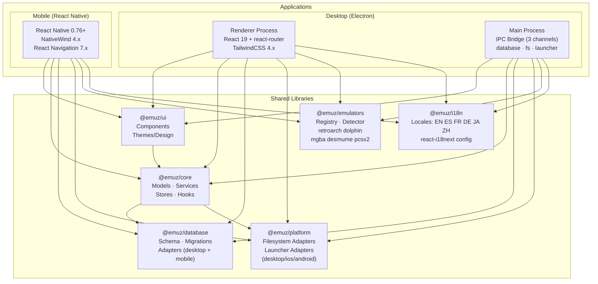
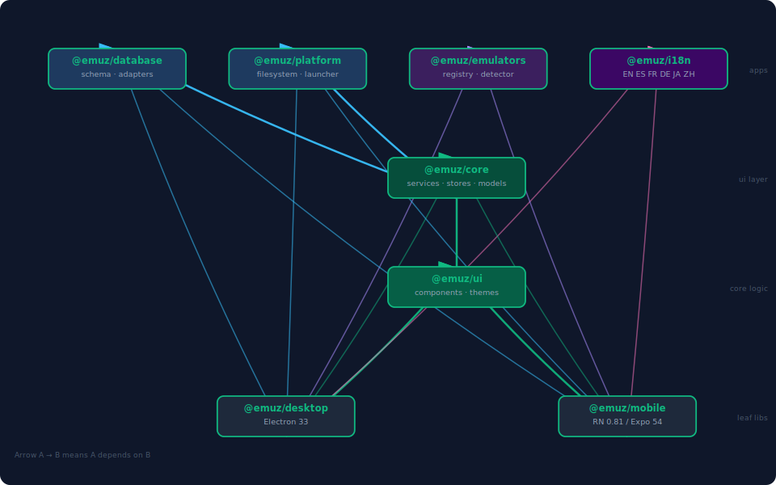
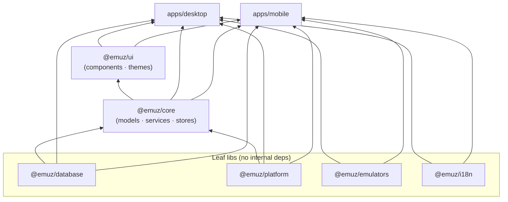
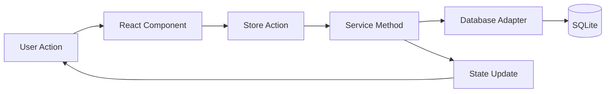
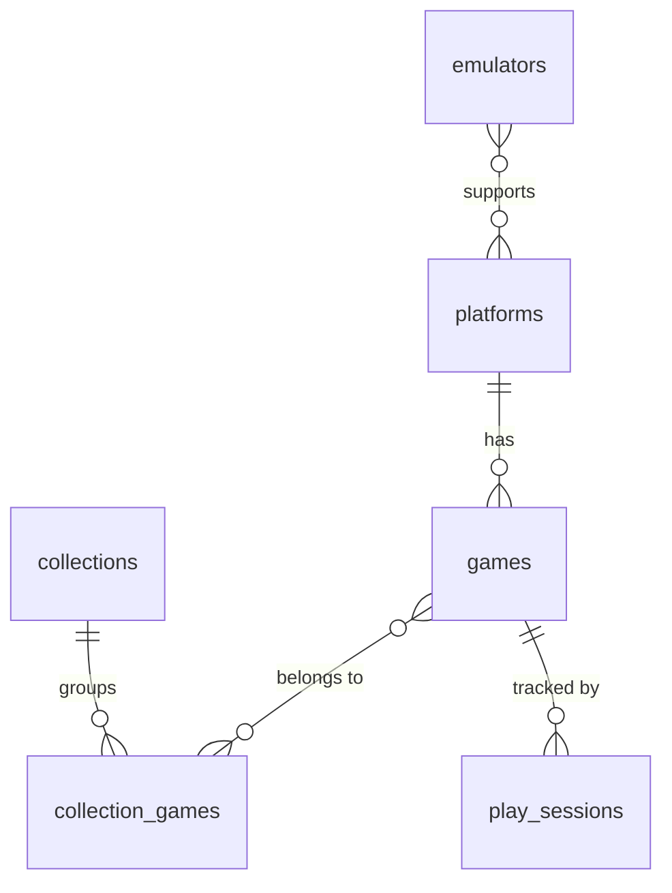

# EmuZ Architecture

> _A Daijishou-inspired cross-platform emulator frontend_

## Overview

EmuZ is a modern, cross-platform emulator frontend built with a focus on user experience, performance, and extensibility. It supports desktop (Windows, macOS, Linux) and mobile (Android, iOS) platforms through a shared codebase.

## Architecture Diagram



## Nx Dependency Graph

Generated from `nx graph --file=nx-graph.json` — arrows point from dependent → dependency:



> Run `pnpm nx graph` to open the interactive version in your browser.

Generated from `nx graph` — dependency directions flow bottom-up:



### Dependency Table

| Package           | Depends On (internal)              | Dependents                                  |
| ----------------- | ---------------------------------- | ------------------------------------------- |
| `@emuz/database`  | —                                  | `@emuz/core`, `apps/desktop`, `apps/mobile` |
| `@emuz/platform`  | —                                  | `@emuz/core`, `apps/desktop`, `apps/mobile` |
| `@emuz/emulators` | —                                  | `apps/desktop`, `apps/mobile`               |
| `@emuz/i18n`      | —                                  | `apps/desktop`, `apps/mobile`               |
| `@emuz/core`      | `@emuz/database`, `@emuz/platform` | `@emuz/ui`, `apps/desktop`, `apps/mobile`   |
| `@emuz/ui`        | `@emuz/core`                       | `apps/desktop`, `apps/mobile`               |
| `apps/desktop`    | all 6 libs                         | —                                           |
| `apps/mobile`     | all 6 libs                         | —                                           |

## Package Structure

### Applications

#### `apps/desktop` - Electron Desktop Application

- **Framework**: Electron 33.x with electron-vite 2.x
- **Renderer**: React 19.x + react-router-dom 7 + TailwindCSS 4.x
- **State**: Zustand 5.x with React Query 5.x
- **IPC channels**: `database`, `filesystem`, `launcher`
- **Screens**: Home, Library, Platform, Collection, Genre, GameDetail, Settings, SetupWizard

#### `apps/mobile` - React Native Mobile Application

- **Framework**: React Native 0.76+ (bare workflow)
- **Styling**: NativeWind 4.x (Tailwind for React Native)
- **Navigation**: React Navigation 7.x (`RootNavigator` + `TabNavigator`)
- **Screens**: Home, Library, Platforms, PlatformDetail, Collections, CollectionDetail, Genres, GenreDetail, GameDetail, Search, ScanProgress, EmulatorConfig, Settings, Setup

### Libraries

#### `libs/core` - Core Business Logic

Contains all platform-agnostic business logic:

- **Models**: Game, Platform, Emulator, Collection, Widget, Genre, Settings
- **Services**: LibraryService, ScannerService, MetadataService, LaunchService, WidgetService, GenreService
- **Stores**: Zustand stores for state management
- **Hooks**: React hooks for accessing services

#### `libs/database` - Database Layer

SQLite-based persistence layer:

- **ORM**: Drizzle ORM (ADR-013) — typed schema in `schema/index.ts` (`drizzleSchema`, `DrizzleDb`)
- **Schema**: Table definitions via `drizzle-orm/sqlite-core` (`sqliteTable`)
- **Migrations**: Drizzle Kit migrations in `drizzle/` + legacy SQL in `migrations/`
- **Adapters**: Platform-specific database adapters (legacy `DatabaseAdapter` interface — **deprecated**, use `DrizzleDb`)
  - Desktop: `drizzle-orm/better-sqlite3`
  - Mobile: `drizzle-orm/op-sqlite`

#### `libs/ui` - UI Components

Shared UI component library:

- **Components**: Button, Card, GameCard, GameGrid, Sidebar, Widgets, etc.
- **Themes**: Dark theme with Emerald Green (#10B981) accent
- **Design System**: Typography, spacing, colors

#### `libs/emulators` - Emulator Definitions

Database of known emulators:

- **Registry**: All supported emulators with metadata
- **Detector**: Auto-detection logic per platform
- **Launchers**: Command templates and launch logic

#### `libs/platform` - Platform Abstractions

Platform-specific implementations:

- **Filesystem**: Unified file system API across platforms
- **Launchers**: Process spawning / Intent launching

#### `libs/i18n` - Internationalization

Multi-language support:

- **Locales**: EN, ES, FR, DE, JA, ZH
- **Config**: i18next configuration

## Data Flow



### State Management

1. **Zustand Stores**: Application state (library, settings, UI)
2. **React Query**: Server state (async data fetching/caching)
3. **Local State**: Component-specific UI state

### Service Layer

Services provide the business logic layer. All services accept a `DrizzleDb` instance and are defined by interfaces in `libs/core/src/services/types.ts`:

```typescript
// Example: LibraryService
interface ILibraryService {
  getAllGames(options?: PaginationOptions): Promise<Game[]>;
  getGameById(id: string): Promise<Game | null>;
  searchGames(options: SearchOptions): Promise<Game[]>;
  updateGame(id: string, data: Partial<Game>): Promise<Game | null>;
  deleteGame(id: string): Promise<void>;
  toggleFavorite(gameId: string): Promise<void>;
  // ... more methods — see docs/api.md
}
```

## Database Schema

### Core Tables

| Table              | Description                                          |
| ------------------ | ---------------------------------------------------- |
| `games`            | Game entries with metadata incl. `rom_type` (Epic 7) |
| `platforms`        | Gaming platform definitions                          |
| `emulators`        | Configured emulators                                 |
| `collections`      | User-defined game collections                        |
| `collection_games` | Many-to-many collection↔game (composite PK)         |
| `scan_directories` | ROM scan locations                                   |
| `widgets`          | Dashboard widget configuration                       |
| `genres`           | Game genre records (id, name, slug, iconName, color) |
| `settings`         | Key-value application settings store                 |

### Entity Relationships



## Key Features

### Daijishou-Inspired Home Screen

- Configurable widget system
- Recent games, favorites, statistics widgets
- Platform shortcuts with wallpapers

### Platform-Aware Design

- Platform cards with background wallpapers
- Genre-based organization
- User collections

### Smart Library Management

- Recursive ROM scanning
- Hash-based game identification
- Metadata scraping
- Cover art management
- ROM type classification: `'game'` vs `'homebrew'` (ADR-014)

### Emulator Integration

- Auto-detection of installed emulators
- Configurable command templates
- Play session tracking
- Platform-specific launching

## Tech Stack Summary

| Layer           | Desktop                      | Mobile                    |
| --------------- | ---------------------------- | ------------------------- |
| Framework       | Electron 33.x                | React Native 0.76+        |
| UI              | React 19.x                   | React Native + NativeWind |
| Styling         | TailwindCSS 4.x              | NativeWind 4.x            |
| State           | Zustand 5.x                  | Zustand 5.x               |
| Data            | React Query 5.x              | React Query 5.x           |
| Database        | better-sqlite3 + Drizzle ORM | op-sqlite + Drizzle ORM   |
| Build           | Vite                         | Metro                     |
| Monorepo        | Nx 20.x                      | Nx 20.x                   |
| Package Manager | pnpm 9.x                     | pnpm 9.x                  |

## Build System

### Nx Monorepo

- **Version**: Nx 20.x, default project: `mobile`
- **Inference plugins**: `@nx/vite/plugin` (auto-detects `vite.config.*`), `@nx/eslint/plugin`
- **Task caching**: enabled for `build`, `test`, `lint` targets
- **Build ordering**: `^build` dependency ensures libs build before apps
- **Module format**: all libs use ESM (`"type": "module"`)

### Scripts

```bash
# Development
pnpm nx serve desktop      # Electron dev server (Vite + HMR)
pnpm nx start mobile       # Metro bundler

# Build
pnpm nx build desktop      # Build desktop (main + renderer)
pnpm nx build-ios mobile   # iOS release build
pnpm nx build-android mobile # Android release build

# Test
pnpm nx test core          # Test @emuz/core
pnpm nx test core --coverage
pnpm nx run-many -t test   # All projects in parallel

# Affected (CI)
pnpm affected:test         # Test only changed packages

# Lint
pnpm nx run-many -t lint   # Lint all projects

# Visualise
pnpm nx graph              # Open dependency graph in browser
```

## Security Considerations

1. **File Access**: Scoped to user-selected directories
2. **No Network by Default**: Metadata scraping is opt-in
3. **Local Storage**: All data stored locally in SQLite
4. **Platform Sandboxing**: Respects platform security models

## Performance Optimizations

1. **Virtualized Lists**: Large game grids use virtualization
2. **Image Caching**: Cover art cached locally
3. **Lazy Loading**: Components and routes loaded on demand
4. **Database Indexing**: Optimized queries with proper indexes
5. **Incremental Scanning**: Only scan changed files

## Future Considerations

1. **Cloud Sync**: Optional save state/settings sync
2. **Controller Support**: Native controller input
3. **RetroAchievements**: Integration with RetroAchievements
4. **Themes**: User-customizable themes
5. **Plugins**: Extension system for additional features
