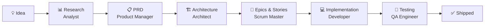
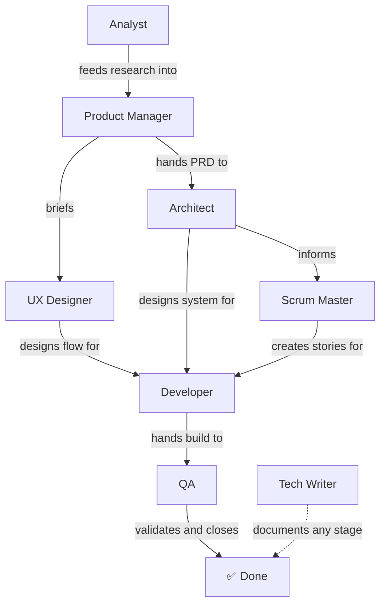
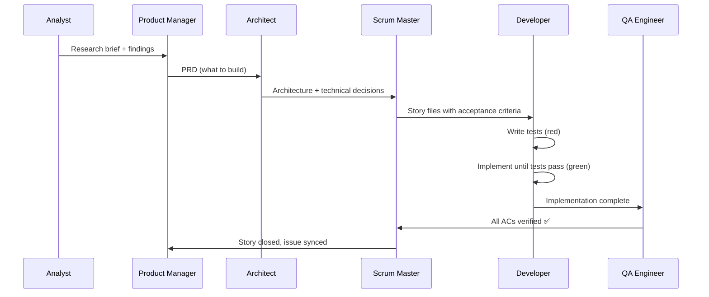

# BMAD Guide — Getting Started for Every Role

BMAD is an AI-driven development framework built into this project. Instead of writing
everything yourself, you work with a team of specialized AI agents — each one an expert
in a specific discipline. You choose an agent, describe what you need, and it guides you
through a structured workflow.

## What is BMAD?

BMAD stands for **B**reakdown, **M**ap, **A**nalyze, **D**evelop. It gives every role
on the team a consistent, repeatable way to collaborate with AI at each stage of the
product lifecycle.



Each box is a stage. Each label is the agent responsible for that stage.
You don't need to do every stage yourself — jump in at the stage that matches your role.

---

## The Agents

| Agent              | Name    | What They Do                                           |
| ------------------ | ------- | ------------------------------------------------------ |
| 📊 Analyst         | Mary    | Research, competitive analysis, requirements discovery |
| 📋 Product Manager | John    | Write and refine the PRD, feature planning             |
| 🏗️ Architect       | Winston | Technical design, ADR decisions, system structure      |
| 🏃 Scrum Master    | Bob     | Sprint planning, story creation, backlog management    |
| 💻 Developer       | Amelia  | Story implementation, test-driven development          |
| 🧪 QA Engineer     | Quinn   | Test strategy, automated tests, coverage analysis      |
| 🎨 UX Designer     | Sally   | User research, interaction design, UI patterns         |
| 📚 Tech Writer     | Paige   | Documentation, diagrams, standards compliance          |

### How the agents relate to each other



---

## Your Role → Your Agent

### I'm a Designer

Your agent: **`/bmad-ux-designer`** (Sally)

Sally helps you define user flows, wireframe concepts, and produce UX specifications
that developers can implement. Start here when you have a feature idea and need to
translate it into interaction patterns.

```
/bmad-ux-designer
```

Then choose: **[UC] Create UX** to start a new design, or **[CH] Chat** to explore ideas.

### I'm a QA Engineer or Tester

Your agent: **`/bmad-qa`** (Quinn)

Quinn helps you write test strategies, generate automated E2E tests, and review
acceptance criteria. Start here after a story has been implemented.

```
/bmad-qa
```

Or to generate tests for a specific feature directly:

```
/bmad-qa-generate-e2e-tests
```

### I'm a Developer

Your agent: **`/bmad-dev`** (Amelia) — for open-ended development chat
Your skill: **`/bmad-dev-story`** — to implement a specific story

To implement the next pending story:

```
/bmad-dev-story _bmad-output/implementation-artifacts/stories/epic-XX/story-X.X-name.md
```

Amelia enforces **test-first development** — she will ask you to write tests before code.

### I'm a Product Manager

Your agent: **`/bmad-pm`** (John)

John helps you write or refine the PRD, plan features, and align requirements.

```
/bmad-pm
```

Choose **[EP] Edit PRD** to refine an existing PRD, or **[CP] Create PRD** to start fresh.

### I'm an Architect

Your agent: **`/bmad-architect`** (Winston)

Winston helps you make technical design decisions, produce ADRs, and document the system
architecture.

```
/bmad-architect
```

### I'm an Analyst

Your agent: **`/bmad-analyst`** (Mary)

Mary helps you research domains, analyze competition, and elicit requirements before
anything gets built.

```
/bmad-analyst
```

### I'm a Scrum Master or Project Lead

Your agent: **`/bmad-sm`** (Bob)

Bob helps you run sprint planning, create story files, and track implementation progress.

```
/bmad-sm
```

---

## The Typical Sprint Flow

Here's how a full sprint moves from idea to shipped feature:



---

## How to Invoke an Agent

Every BMAD agent is a slash command in Claude Code. Type it in the chat input:

```
/bmad-dev
```

The agent loads its persona, reads the project config, and presents a numbered menu.
You pick a number or type a fuzzy match of what you want.

**Example session:**

```
You: /bmad-qa

Quinn: Hi! I'm Quinn, your QA Engineer. What would you like to work on?
       1. [TS] Test Strategy
       2. [E2E] Generate E2E Tests
       ...

You: 2

Quinn: Which feature should I generate tests for?
```

To exit any agent, choose the **[DA] Dismiss Agent** option from its menu.

---

## Tips for Newbies

**Not sure where to start?**

```
/bmad-help
```

The help agent analyzes the current project state and tells you what the next logical
step is — whether that's creating a story, running tests, or updating the PRD.

**Agent handed something off but you're not sure what to do next?**
Look at the output folder: [\_bmad-output/](_bmad-output/) contains all planning artifacts
and story files. The story files in
[\_bmad-output/implementation-artifacts/stories/](_bmad-output/implementation-artifacts/stories/)
each contain full context: acceptance criteria, technical notes, and implementation hints.

**Story file statuses to know:**

| Status                 | Means                            |
| ---------------------- | -------------------------------- |
| `Pending`              | Ready to pick up — not started   |
| `In Progress`          | Being worked on                  |
| `Done`                 | Complete, GitHub issue closed    |
| `Done (tests pending)` | Code shipped, tests still needed |

**BMAD and GitHub stay in sync.** When a story changes status, the corresponding GitHub
issue is updated at the same time. Check open issues to see the live state of the sprint.
